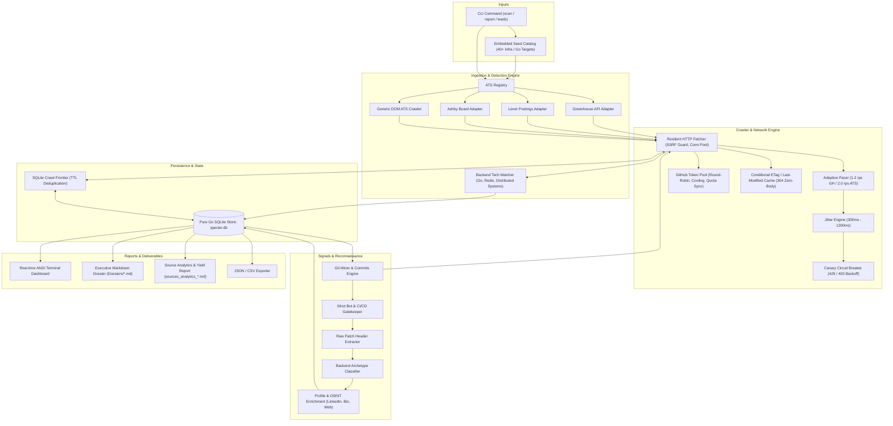
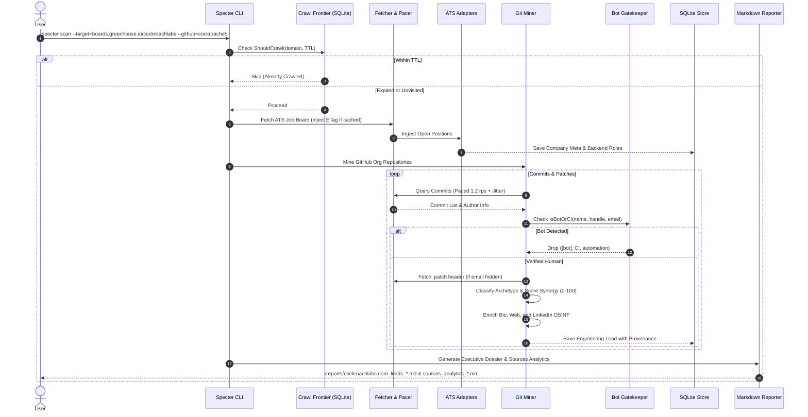

# Specter ⚡

**Specter** is a high-performance, autonomous CLI reconnaissance and engineering lead discovery engine written in pure Go (1.23+). Designed for engineering leaders, technical recruiters, and founders, Specter discovers high-signal backend hiring indicators, maps public ATS boards (Greenhouse, Lever, Ashby, direct portals), mines public Git commit metadata and patch headers for verified contact emails, enforces provenance lineage, and produces executive Markdown dossiers with personalized outreach drafts.

---

## Architecture Diagram



---

## Pipeline Dataflow



---

## Core Capabilities & Technical Highlights

### 1. Adaptive Networking, Pacing & Circuit Breaker
- **Per-Host Token Buckets:** Strict rate limits via `golang.org/x/time/rate`:
  - `api.github.com` capped at `1.2 req/s` (burst: 2).
  - ATS and generic portals capped at `2.0 req/s` (burst: 4).
- **Randomized Timing Jitter:** Introduces randomized delay between `300ms` and `1200ms` per outgoing request to prevent deterministic traffic profiling.
- **Canary Circuit Breaker:**
  - Transitions across `StateClosed`, `StateOpen`, and `StateHalfOpen`.
  - Automatically triggers on HTTP 429 (Too Many Requests) or HTTP 403 (Rate Limit Exceeded).
  - Parses `Retry-After` or applies truncated exponential backoff ($2^n \times \text{base\_delay} + \text{jitter}$, max 60s).
  - Upon backoff expiry, releases exactly **one canary probe** while holding other workers on a broadcast channel. Successful canary re-opens the queue; failure escalates backoff.

### 2. Multi-Token GitHub Pool & Quota Manager
- **Multi-Token Loading:** Loads tokens from `GITHUB_TOKENS` (comma-separated) or `GITHUB_TOKEN`.
- **Health & Quota Tracking:** Tracks `Remaining`, `ResetAt`, and `IsCooling` per token.
- **Cooling Threshold:** If a token drops below 25 remaining requests, it automatically enters a cooling period until its reset timestamp.
- **Dynamic Reset Wait:** If all tokens are cooling, blocks dynamically until the earliest `ResetAt` rather than dropping requests.
- **Header Synchronization:** Inspects `X-RateLimit-Remaining` and `X-RateLimit-Reset` on every response to maintain live synchronization.

### 3. Conditional Requests via ETags
- **Persistent Conditional Caching:** Stores `ETag` and `Last-Modified` in SQLite `crawl_frontier`.
- **Automatic Header Injection:** Injects `If-None-Match` and `If-Modified-Since` on repeat visits.
- **HTTP 304 Handling:** Bypasses body reading and JSON decoding on 304 Not Modified, updating `last_crawled_at` with zero quota consumption.

### 4. Strict Bot & CI/CD Exclusion
- Immediate exclusion gate for automated bots and CI accounts.
- Blocks bot names/handles containing `[bot]`, `ci`, `cd`, `automation`, `teamcity`, `jenkins`, `circleci`, `buildkite`, `dependabot`, `sentry`, `codecov`, `-bot`, `bot-`.
- Drops automated emails like `noreply.github.com`, `actions@`, `teamcity@`, `dependabot@`, etc.

### 5. Data Provenance & Lineage
- Every engineering lead is tracked with exact source attribution:
  - `repo_name` & `repo_url` (e.g. `cockroachdb/pebble`)
  - `commit_sha` & `commit_url` (e.g. `0457a36` clickable link to GitHub commit)
  - `bio`, `website_url`, `location`
  - `linkedin_url` (parsed from profile/blog or deterministic Google OSINT search fallback)
  - `matched_signals` (Go, Distributed Systems, High Throughput, Concurrency)

### 6. Backend Role Archetypes & Synergy Scoring
- Categorizes engineers into archetypes:
  - **Engineering Leadership:** VP, Director, Head of Engineering, Engineering Manager, Lead Architect.
  - **Staff / Principal:** Principal Engineer, Staff Engineer, Distributed Systems Architect.
  - **Senior Backend:** Senior Go Engineer, Senior Systems Engineer.
  - **Core Contributor:** Core Storage Engineer, Core Networking Engineer, etc.
- Word-boundary tokenization prevents false positives (e.g. `refactor` does not trigger `cto`).
- 0–100 synergy score incorporates commit volume, language synergy, and role impact.

### 7. Executive Dossiers & Sources Analytics Reports
- **Executive Dossier (`reports/{domain}_leads_{date}.md`):**
  - Company Overview, hiring demand, headquarters, and tech fingerprint.
  - Leads Matrix: Score, Name, Archetype, Email, GitHub, LinkedIn/Web, Provenance (Commit / Repo), Top Tech.
  - Contextual Outreach Drafts: 3 customized icebreakers tailored to Leadership, Staff, and Senior Contributor archetypes.
- **Aggregated Sources Analytics (`reports/sources_analytics_{date}.md`):**
  - Top producing repositories ranked by lead yield.
  - Repository yield table with commit count, verified leads, extracted emails, and yield percentage.
  - Lead lineage, archetype distribution, and target domain coverage.

---

## Directory Layout

```
specter/
├── cmd/
│   └── specter/
│       └── main.go                 # CLI entry point (scan, leads, report, roles, companies, export)
├── configs/
│   └── seeds.json                 # Pre-populated catalog of 40+ high-signal backend companies
├── internal/
│   ├── ats/
│   │   ├── ashby.go               # Ashby job-board API adapter
│   │   ├── generic.go             # Generic HTML DOM crawler with embedded ATS detection
│   │   ├── greenhouse.go          # Greenhouse public boards API adapter
│   │   ├── lever.go               # Lever public postings API adapter
│   │   ├── models.go              # ATS domain models & CompanyMeta
│   │   └── registry.go            # Adapter resolution and dispatch engine
│   ├── crawler/
│   │   ├── fetcher.go             # Resilient HTTP client (SSRF guard, conn pool, ETag injection)
│   │   ├── frontier.go            # Persistent crawl frontier, SQLite TTL cache, conditional headers
│   │   ├── pacer.go               # Per-host token buckets, jitter engine, canary circuit breaker
│   │   ├── ratelimit.go           # Adaptive host rate limiter (backwards compatibility)
│   │   ├── scope.go               # Domain boundary & subdomain scoping rules
│   │   └── token_pool.go          # Multi-token pool, quota tracker, cooling thresholds
│   ├── exporter/
│   │   └── export.go              # JSON and CSV lead exporter
│   ├── reporter/
│   │   ├── markdown.go            # Executive technical dossier generator with archetype outreach
│   │   └── sources_report.go      # Sources analytics & repository lead yield generator
│   ├── seeds/
│   │   └── seeds.go               # Embedded target seed catalog loader
│   ├── signals/
│   │   ├── git_miner.go           # Public Git miner, email harvester, patch parser, bot gate
│   │   ├── github.go              # GitHub repository and commit exploration helpers
│   │   └── matcher.go             # Backend keyword and technology matcher
│   ├── storage/
│   │   └── store.go               # Pure Go SQLite store (modernc.org/sqlite) & schema migrations
│   └── ui/
│       └── progress.go            # Real-time ANSI terminal progress tracker
├── reports/                       # Generated dossiers and source analytics reports
├── go.mod
├── go.sum
└── README.md
```

---

## Installation & Build

Requires Go 1.23+:

```bash
git clone https://github.com/mahanmntz/specter.git
cd specter
go build -o specter ./cmd/specter
```

---

## CLI Usage

### 1. Autonomous Run Across Seed Catalog
Scan all 40+ pre-configured high-signal backend and infrastructure targets:
```bash
./specter scan --all --concurrency=4 --limit=10 --ttl=7
```

### 2. Single Target Scan
Scan a specific company ATS board and GitHub organization:
```bash
# Greenhouse board
./specter scan --target=boards.greenhouse.io/cockroachlabs --github=cockroachdb --ttl=0

# Lever board
./specter scan --target=jobs.lever.co/netflix

# Ashby board
./specter scan --target=jobs.ashbyhq.com/linear
```

### 3. Discovered Leads Querying
List all verified engineering leads sorted by synergy score:
```bash
./specter leads list
```

Filter by domain or uncontacted status:
```bash
./specter leads list --domain=cockroachlabs.com --uncontacted
```

Mark lead as contacted:
```bash
./specter leads contact --id=1
```

### 4. Generate Reports
Regenerate an executive dossier for a scanned domain:
```bash
./specter report --domain=cockroachlabs.com --out-dir=reports
```

### 5. Export Data
Export all leads and open roles to JSON or CSV:
```bash
./specter export --format=json --output=leads.json
./specter export --format=csv --output=leads.csv
```

---

## Test Suite & Race Detector

All packages are tested with Go's race detector enabled:

```bash
go test -v -race ./...
```

---

## License

MIT License. Built for ethical technical reconnaissance and engineering discovery.
