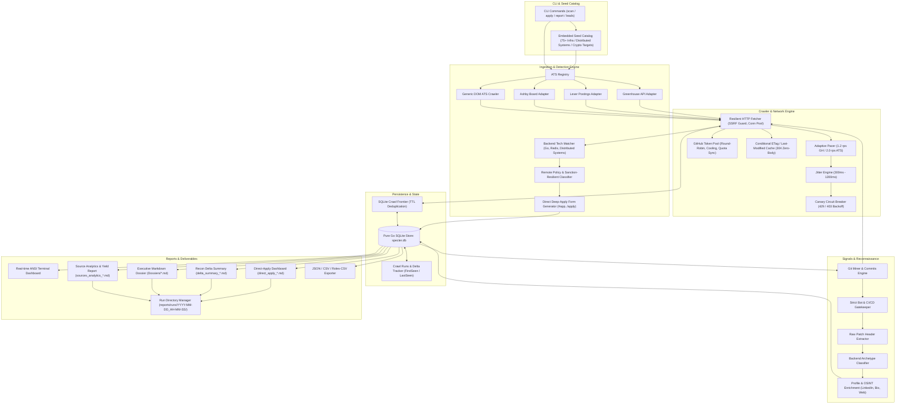
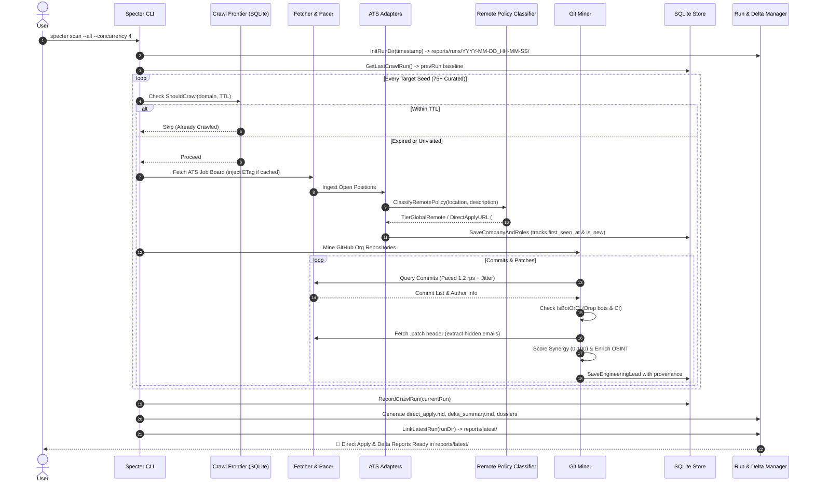

# Specter ⚡

**Specter** is a high-performance, autonomous CLI reconnaissance and engineering lead discovery engine written in pure Go (1.23+). Designed for engineering leaders, technical recruiters, founders, and global remote software engineers, Specter discovers high-signal backend hiring indicators, maps public ATS boards (Greenhouse, Lever, Ashby, direct portals), detects **worldwide contractor-friendly (sanction-resilient) positions with deep one-click application links**, mines public Git commit metadata and patch headers for verified contact emails, enforces provenance lineage, and produces date-stamped execution archives with delta tracking.

---

## Architecture Diagram



---

## Pipeline Dataflow



---

## Key Capabilities & Features

### 1. 🎯 Direct One-Click Apply Dashboard (`specter apply`)
- **Direct Form Deep-Linking:** Automatically extracts and rewrites job posting URLs into direct application form deep links:
  - **Greenhouse:** Appends `#app` anchor to bypass marketing blurbs and jump straight to the submission form.
  - **Lever:** Points to `/apply` endpoints directly.
  - **Ashby:** Deep-links into `/application` forms.
- **Fast-Track Pitch Generator:** Generates a custom 3-sentence application note emphasizing asynchronous distributed systems experience and pre-configured B2B contractor invoicing (Deel/crypto) to eliminate corporate hesitation.

### 2. 🌍 Global-Remote & Third-World / Sanction-Friendly Classifier
Engineers located in non-US/EU emerging tech markets (MENA, LATAM, Eastern Europe, South Asia) frequently encounter compliance walls (W-2 requirements, US citizenship, strict export controls). Specter classifies roles into 3 distinct tiers:
- 🟢 **Worldwide / Contractor-Friendly (`TierGlobalRemote`):** Explicitly welcomes global candidates, uses contractor/B2B invoicing via **Deel / Remote.com / crypto (USDC)**, has zero domestic tax residency barriers.
- 🟡 **Timezone-Flexible (`TierTimezoneFlexible`):** Remote positions requiring timezone overlap (e.g. EMEA / UTC ± 3 hours).
- 🔴 **Geo-Restricted (`TierGeoRestricted`):** Domestic US/EU only, strict W-2 payroll, or security clearance requirements.

### 3. 🔄 Run-Based Date-Stamped Directories & Delta Tracking
- **Automated Run Isolation:** Every autonomous scan stores output files in an immutable, date-stamped folder:
  ```
  reports/runs/2026-10-01_18-30-00/
  ├── direct_apply_2026-10-01.md
  ├── delta_summary_2026-10-01.md
  ├── sources_analytics_2026-10-01.md
  └── {company}_leads_2026-10-01.md
  ```
- **Live Latest Pointer:** Atomically links `reports/latest` to the most recent run so you never have to search for the newest report.
- **Delta Summary (`delta_summary.md`):** Automatically compares against the previous crawl run from SQLite (`crawl_runs`), highlighting:
  - `+N fresh roles` discovered for the first time (`[NEW]` badge).
  - `+M fresh engineering leads` sourced since the last run.
  - Prevents duplicate candidate outreach and redundant job applications.

### 4. 💎 75+ Embedded High-Signal Curated Seeds
Pre-configured with leading infrastructure, database, and devtools companies known for hiring worldwide contractors and distributed systems engineers:
- **Core Cloud & Systems:** HashiCorp, Cloudflare, Grafana Labs, CockroachDB, Monzo, Fly.io, Meilisearch, Timescale, Supabase, 1Password, Tailscale, Datadog, Docker, Redpanda, ScyllaDB, ClickHouse, Neon.
- **Remote-First Pioneers & Boutique Devtools:** Canonical, Automattic, DuckDuckGo, PostHog, Status.im, Kraken, LiveKit, Railway, Deno, QuestDB, Tinybird, Doppler, Incident.io, Turso, Warp, Depot, Upstash, Resend, Infracost, GitBook, Axiom, Teleport, Qdrant, DragonflyDB.

### 5. 🛡️ Resilient Networking & Bot Filtration
- **Adaptive Pacer:** Per-host token buckets (1.2 rps GitHub, 2.0 rps ATS) with 300–1200ms randomized jitter.
- **Canary Circuit Breaker:** Exponential backoff upon HTTP 429/403 with single-worker canary probes.
- **Multi-Token GitHub Pool:** Automatic round-robin rotation, remaining quota inspection, and cooling periods.
- **Bot Exclusions:** Blocks `[bot]`, CI/CD pipelines, Dependabot, Jenkins, TeamCity, and `noreply.github.com` addresses.

---

## Directory Layout

```
specter/
├── cmd/
│   └── specter/
│       ├── main.go                 # CLI entry point (scan, apply, leads, report, roles, companies, export)
│       └── sync.go                 # Google Sheets synchronization commands
├── configs/
│   └── seeds.json                 # Pre-populated catalog of 75+ curated tech companies
├── internal/
│   ├── ats/
│   │   ├── ashby.go               # Ashby job-board API adapter with direct application links
│   │   ├── generic.go             # Generic HTML DOM crawler with embedded ATS detection
│   │   ├── greenhouse.go          # Greenhouse public boards API adapter (#app deep-linking)
│   │   ├── lever.go               # Lever public postings API adapter (/apply deep-linking)
│   │   ├── models.go              # ATS domain models, JobPosting & CompanyMeta
│   │   └── registry.go            # Adapter resolution and dispatch engine
│   ├── config/
│   │   └── env.go                 # Zero-dependency .env parser and environment loader
│   ├── crawler/
│   │   ├── fetcher.go             # Resilient HTTP client (SSRF guard, conn pool, ETag injection)
│   │   ├── frontier.go            # Persistent crawl frontier, SQLite TTL cache, conditional headers
│   │   ├── pacer.go               # Per-host token buckets, jitter engine, canary circuit breaker
│   │   ├── token_pool.go          # Multi-token pool, quota tracker, cooling thresholds
│   │   └── scope.go               # Domain boundary & subdomain scoping rules
│   ├── exporter/
│   │   └── export.go              # JSON, CSV, and Roles-CSV exporter
│   ├── reporter/
│   │   ├── direct_apply.go        # One-click direct application dashboard generator
│   │   ├── delta_report.go        # Delta comparison report between crawl runs
│   │   ├── runs_manager.go        # Date-stamped run directory isolation & latest link pointer
│   │   ├── markdown.go            # Executive technical dossier generator with outreach drafts
│   │   └── sources_report.go      # Sources analytics & repository lead yield generator
│   ├── seeds/
│   │   └── seeds.go               # Embedded target seed catalog loader
│   ├── signals/
│   │   ├── git_miner.go           # Public Git miner, email harvester, patch parser, bot gate
│   │   ├── matcher.go             # Backend keyword and technology matcher
│   │   ├── remote_policy.go       # Remote policy, sanction resilience, and quick pitch generator
│   │   └── verifier.go            # Fast in-memory DNS MX domain email verification cache
│   ├── storage/
│   │   └── store.go               # Pure Go SQLite store (modernc.org/sqlite) & schema migrations
│   ├── sync/
│   │   └── sheets.go              # Google Sheets two-tab sync engine with retries and chunking
│   └── ui/
│       └── progress.go            # Real-time ANSI terminal progress tracker
├── reports/                       # Generated dossiers, direct apply dashboards, and run archives
│   ├── latest -> runs/...         # Symlink to the most recent crawl run
│   └── runs/                      # Historical date-stamped execution archives
├── scripts/
│   └── google_apps_script.js      # Production Google Apps Script webhook handler (Contacts & Jobs)
├── .env.example                   # Environment configuration template
├── go.mod
├── go.sum
└── README.md
```

---

## Environment Configuration (`.env`)

Specter features a pure Go, zero-dependency `.env` configuration loader. Copy the example template to get started:

```bash
cp .env.example .env
```

Edit `.env` to configure your environment variables:

| Variable | Description | Default / Example |
| :--- | :--- | :--- |
| `GITHUB_TOKENS` | Comma-separated list of GitHub Personal Access Tokens for rate-limit rotation. | `ghp_token1,ghp_token2` |
| `MY_SKILLS` | Comma-separated list of your technical skills for personalized synergy matching. | `Go, Distributed Systems, Kubernetes, Docker, PostgreSQL, Redis, Microservices, Linux, gRPC, Cloud` |
| `SPECTER_SHEETS_WEBHOOK` | Target Google Apps Script Webhook URL for two-tab synchronization. | `https://script.google.com/macros/s/.../exec` |
| `SPECTER_CONCURRENCY` | Default concurrency level for crawl workers. | `4` |
| `SPECTER_PACER_DELAY_MS` | Base pacing delay in milliseconds between requests per host. | `800` |
| `SPECTER_MAX_REPOS` | Maximum repositories to mine per organization. | `15` |
| `SPECTER_MAX_COMMITS` | Maximum commits to analyze per repository. | `30` |

---

## Google Sheets Two-Tab Synchronization Setup

Specter can stream discovered technical contacts and direct-apply job postings directly into a single Google Sheet organized into two synchronized tabs:
- **Tab 1: Contacts** (Technical Leads, Staff/Principal Engineers, Core Contributors, verified emails, LinkedIn profiles, and personalized outreach icebreakers).
- **Tab 2: Jobs** (Active open backend & remote roles, contractor-friendly flags, compensation, and deep one-click apply links).

### Setup in 60 Seconds:
1. Open or create a Google Sheet at [sheets.google.com](https://sheets.google.com).
2. Go to **Extensions** → **Apps Script**.
3. Replace all default code in `Code.gs` with the complete script from [`scripts/google_apps_script.js`](file:///Users/mahan/development/backend-pr/specter/scripts/google_apps_script.js).
4. Click **Deploy** → **New Deployment**.
5. Select type: **Web app**.
   - **Execute as**: *Me*
   - **Who has access**: *Anyone*
6. Click **Deploy**, authorize access, and copy the **Web app URL**.
7. Paste this URL into your `.env` file:
   ```env
   SPECTER_SHEETS_WEBHOOK="https://script.google.com/macros/s/YOUR_SCRIPT_ID/exec"
   ```

---

## Installation & Build

Requires Go 1.23+:

```bash
git clone https://github.com/mahanmntz/specter.git
cd specter
go build -o specter ./cmd/specter
```

---

## CLI Usage Guide

### 1. Autonomous Run Across Seed Catalog
Launch an autonomous discovery run across the curated catalog of 75+ targets. Use `--force` to bypass the 7-day frontier cache and mine fresh data from all organizations:
```bash
# Autonomous scan across all seeds with 4 concurrent workers
./specter scan --all --concurrency=4 --limit=15

# Force fresh crawl across all companies (bypassing 7-day frontier cache)
./specter scan --all --concurrency=4 --force

# Autonomous scan with automatic post-scan Google Sheets sync
./specter scan --all --concurrency=4 --sync-sheets
```
Output:
- Saves all dossiers, direct-apply dashboards, and delta summaries to `reports/runs/YYYY-MM-DD_HH-MM-SS/`.
- Updates `reports/latest` symlink.

### 2. Google Sheets Autonomous Synchronization (`specter sync sheets`)
Push mined leads and active roles into your Google Sheet:

```bash
# Synchronize both Contacts and Jobs tabs (default: --target=all)
./specter sync sheets

# Synchronize only Contacts (Engineering Leads)
./specter sync sheets --target=leads

# Synchronize only Jobs (Direct One-Click Apply Roles)
./specter sync sheets --target=jobs

# Synchronize only worldwide & contractor-friendly (sanction-resilient) jobs
./specter sync sheets --target=jobs --global-only

# Dry-run inspection without sending network requests
./specter sync sheets --dry-run --target=all --limit=5

# Re-synchronize all records regardless of previous sync status
./specter sync sheets --all --target=all

# Override webhook URL on the command line
./specter sync sheets --webhook="https://script.google.com/macros/s/.../exec"
```

### 3. Direct One-Click Apply Board (`specter apply`)
Query active roles with direct deep-application links directly in your terminal:

```bash
# List all worldwide & contractor-friendly roles (sanction-resilient)
./specter apply --global-only

# Filter for brand-new openings discovered since the last run
./specter apply --global-only --fresh-only

# Filter by company domain and generate a markdown dashboard
./specter apply --domain=railway.app --export
```

### 4. Targeted Single Scan
Scan a specific company ATS board and GitHub organization:
```bash
# Greenhouse board with GitHub miner (auto-bypasses frontier cache)
./specter scan --target=boards.greenhouse.io/canonical --github=canonical

# Lever board
./specter scan --target=jobs.lever.co/posthog --github=posthog

# Ashby board
./specter scan --target=jobs.ashbyhq.com/railway --github=railwayapp
```

### 5. Discovered Leads Management
List all verified engineering leads sorted by synergy score:
```bash
./specter leads list --uncontacted
```

Filter by domain:
```bash
./specter leads list --domain=cockroachlabs.com
```

Mark lead as contacted:
```bash
./specter leads contact --id=42
```

### 6. Export Datasets
Export all records to JSON or CSV:
```bash
# Export direct apply roles to CSV
./specter export --format=roles-csv --output=direct_apply_roles.csv

# Export full database bundle to JSON
./specter export --format=json --output=specter_full.json
```

---

## Testing & Quality Assurance

Specter is strictly tested with Go's race detector enabled:

```bash
go test -v -race ./...
```

---

## License

MIT License. Designed for ethical engineering reconnaissance, lead discovery, and frictionless global remote opportunities.
